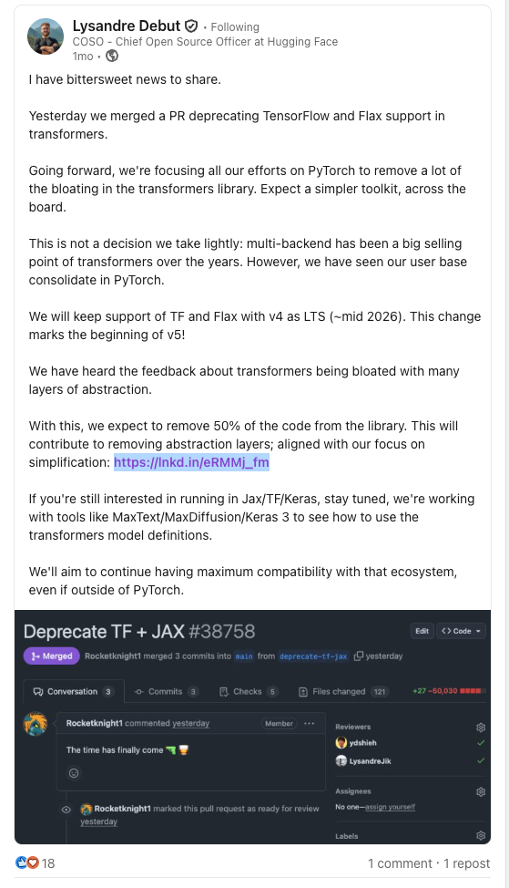

How to run a HuggingFace model in Jax (Part 1)
======================================

HuggingFace recently removed Jax & TF support, with the goal of 
simplifying its codebase. What if HuggingFace can continue to 
support Jax users without reimplementing all their models in Jax?



In this blog, I want to explore what will it take to make HuggingFace's
Pytorch model run with Jax inputs, and potentially present to Jax users another 
way out if they are currently using any HuggingFace models.

## Background / Approach

Why am I doing this? I am the author of [torchax](https://github.com/pytorch/xla/tree/master/torchax)
A young library for make Jax and PyTorch interoperable. This is a great exersize for 
stress testing torchax. Here it goes:

## Setup

Let's start with [HuggingFace quickstart](https://huggingface.co/docs/transformers/en/quicktour). It incites the following setup:

```bash
# create venv / conda env; activate etc.
pip huggingface-cli 
huggingface-cli login # setup the token
pip install -U transformers datasets evaluate accelerate timm
```

We will also install torchax from the lastest HEAD:

```bash
pip install torchax
```

## First attempt, eager mode

Now let's with instantiating the model and tokenizer:
We will create a script `jax_hg_01.py` with the following

```python
from transformers import AutoModelForCausalLM, AutoTokenizer

model = AutoModelForCausalLM.from_pretrained("meta-llama/Llama-2-7b-hf", torch_dtype="bfloat16", device_map="cpu")
tokenizer = AutoTokenizer.from_pretrained("meta-llama/Llama-2-7b-hf")
model_inputs = tokenizer(["The secret to baking a good cake is "], return_tensors="jax")
print(model_inputs)
```

For the tokenizer, we want it to return Jax instead because 
we are trying to run the PyTorch model with Jax arrays. So I added
`return_tensors="jax"`. If you run the above you will get 

```
{'input_ids': Array([[    1,   450,  7035,   304,   289,  5086,   263,  1781,   274,
         1296,   338, 29871]], dtype=int32), 'attention_mask': Array([[1, 1, 1, 1, 1, 1, 1, 1, 1, 1, 1, 1]], dtype=int32)}
```

Now, we can use torchax and try to convert this PyTorch model into 
a Jax callable, and try to call it.

Modify the python script with:

```python
import torchax
weights, func = torchax.extract_jax(model)
```

Currently the above function `extract_jax` will convert the model's `forward` function
into a Jax callable. It will also return the model's weights as a Pytree of Jax arrays
(it's actually the state dict of the model from `model.state_dict()`)

Now we can call this function with Jax arrays. The calling convention is:
first arg is weight, the second arg is a tuple for `args` and finally an optional 
tuple for `kwargs`.

so:

```python
print(func(weights, (model_inputs.input_ids, )))
```

Trying it out: 
```
In [2]: import torchax

In [3]: weights, func = torchax.extract_jax(model)
WARNING:root:Duplicate op registration for aten.__and__

In [4]: print(func(weights, (model_inputs.input_ids, )))
CausalLMOutputWithPast(loss=None, logits=Array([[[-12.950611  ,  -7.4854484 ,  -0.42371067, ...,  -6.819363  ,
          -8.073828  ,  -7.5583534 ],
        [-13.508438  , -11.716616  ,  -6.9578876 , ...,  -9.135823  ,
         -10.237023  ,  -8.56888   ],
        [-12.8517685 , -11.180469  ,  -4.0543456 , ...,  -7.9564795 ,
         -11.546011  , -10.686134  ],
        ...,
        [ -2.983235  ,  -5.621302  ,  11.553352  , ...,  -2.6286669 ,
          -2.8319468 ,  -1.9902805 ],
        [ -8.674949  , -10.042385  ,   3.4400458 , ...,  -3.7776647 ,
          -8.616567  ,  -5.7228904 ],
        [ -4.0748825 ,  -4.706395  ,   5.117742  , ...,   6.7174563 ,
           0.5748794 ,   2.506649  ]]], dtype=float32), past_key_values=DynamicCache(), hidden_states=None, attentions=None)
```

It works!

Now say we want to pass kwargs to this function we can do so:

```python
print(func(weights, (model_inputs.input_ids, ), {'use_cache': False}))
```

The above function ran Jax, but it is Jax's eager mode. As jaxers usually know,
we really need to compile the function and harness 
[the power and speed of Jax](https://docs.jax.dev/en/latest/faq.html#is-jax-faster-than-numpy).
So naturally the next step is to `jax.jit`'d it.

## Jitting - fiddle with Pytrees

In Jax, to jit a callable is simply wrapping in `jax.jit`. Let's try that

```python
func_jit = jax.jit(func)
res = func_jit(weights, (model_inputs.input_ids,))
```
Add the above to our script, and run it, we got the following:

```
The above exception was the direct cause of the following exception:

Traceback (most recent call last):
  File "/home/hanq_google_com/learning_machine/jax-huggingface/script.py", line 18, in <module>
    res = func_jit(weights, (model_inputs.input_ids,))
TypeError: function jax_func at /home/hanq_google_com/pytorch/xla/torchax/torchax/__init__.py:52 traced for jit returned a value of type <class 'transformers.modeling_outputs.CausalLMOutputWithPast'>, which is not a valid JAX type
```

Oh no! So What is happening is that Jax does not know what is 
`CausalLMOutputWithPast`. When you `jax.jit` Jax requires that 
all your inputs are "Jax type". Which really means that 
`jax.tree.flatten` will make it into a list of things that Jax understand. To accomplish that, one only need to register this type 
to [Jax's pytree system](https://docs.jax.dev/en/latest/pytrees.html#extending-pytrees). In other words:

```python
from jax.tree_util import register_pytree_node
from transformers import modeling_outputs

def output_flatten(v):
  return v.to_tuple(), None

def output_unflatten(aux, children):
  return modeling_outputs.CausalLMOutputWithPast(*children)

register_pytree_node(
  modeling_outputs.CausalLMOutputWithPast,
  output_flatten,
  output_unflatten,
)
```

Now, Jax knows that `CausalLMOutputWithPast` can decompose into 
a tuple of elements, and each of them are things that Jax knows about.

Running again yields:

```
Traceback (most recent call last):
  File "/home/hanq_google_com/learning_machine/jax-huggingface/script.py", line 33, in <module>
    res = func_jit(weights, (model_inputs.input_ids,))
TypeError: function jax_func at /home/hanq_google_com/pytorch/xla/torchax/torchax/__init__.py:52 traced for jit returned a value of type <class 'transformers.cache_utils.DynamicCache'> at output component [1], which is not a valid JAX type
```

So the same pytree trick again:

```python
from transformers import cache_utils

def _flatten_dynamic_cache(dynamic_cache):
  return (
      dynamic_cache.key_cache,
      dynamic_cache.value_cache,
  ), None

def _unflatten_dynamic_cache(aux, children):
  cache = cache_utils.DynamicCache(),
  cache.key_cache, cache.value_cache = children
  return cache

register_pytree_node(
  cache_utils.DynamicCache,
  _flatten_dynamic_cache,
  _unflatten_dynamic_cache,
)
```

Now we are past this issue. However, we still encounter another
exception.

```
jax.errors.ConcretizationTypeError: Abstract tracer value encountered where concrete value is expected: traced array with shape bool[]
This occurred in the item() method of jax.Array
The error occurred while tracing the function jax_func at /home/hanq_google_com/pytorch/xla/torchax/torchax/__init__.py:52 for jit. This concrete value was not available in Python because it depends on the value of the argument kwargs['use_cache'].

See https://docs.jax.dev/en/latest/errors.html#jax.errors.ConcretizationTypeError
```

## Static arguments

Looking at the stacktrace above, we can find this line
`if use_cache and past_key_values is None:`. Seasoned jaxers will remember
that when we do `jax.jit`; every input will be assumed to be a `Tracer`, and
we cannot read the actual value of the variable, in this case `use_cache`. 

The usual fix is either pass `static_argnums` to `jax.jit` to tell `jax` that
it is in fact a constant, another way is to use a closure.

We will use the second method for illustration. Define another function that 
routes the inputs to the original function, and jit that:

```
def func_with_constant(weights, input_ids):
  res = func(weights, (input_ids, ), {'use_cache': False})
  return res

jitted_func = jax.jit(func_with_constant)
res = jitted_func(weights, model_inputs.input_ids)
print(res)
```

Running this yields:

```
CausalLMOutputWithPast(loss=Array([[[-12.926737  ,  -7.455758  ,  -0.42932802, ...,  -6.822556  ,
          -8.060653  ,  -7.5620213 ],
        [-13.511845  , -11.716769  ,  -6.9498663 , ...,  -9.14628   ,
         -10.245605  ,  -8.572137  ],
        [-12.842418  , -11.174898  ,  -4.0682483 , ...,  -7.9594035 ,
         -11.54412   , -10.675278  ],
        ...,
        [ -2.9683495 ,  -5.5914016 ,  11.563716  , ...,  -2.6254666 ,
          -2.8206763 ,  -1.9780521 ],
        [ -8.675585  , -10.044738  ,   3.4449315 , ...,  -3.7793014 ,
          -8.6158495 ,  -5.729558  ],
        [ -4.0751734 ,  -4.69619   ,   5.111123  , ...,   6.733637  ,
           0.57132554,   2.524692  ]]], dtype=float32), logits=None, past_key_values=None, hidden_states=None, attentions=None)
```

which is what we had in eager mode. Now, we successfully converted a 
Pytorch model to Jax function, made it work with `jax.jit` and run it.

One property of `jax.jit`'d function is that it runs slower on the first run
(because of compilation), then it runs much faster. We can verify that
by:

```python
for i in range(3):
  start = time.time()
  res = jitted_func(weights, model_inputs.input_ids)
  jax.block_until_ready(res)
  end = time.time()
  print(i, end - start, 'seconds')
```

which gives:
```
0 4.365400552749634 seconds
1 0.01341700553894043 seconds
2 0.013022422790527344 seconds
```
I ran my example above using Google Cloud TPU v6e. On H100 probably will yield 
similar effect.

The full script is located in [jax_hg_01.py](jax_hg_01.py) in the same repo.

## Conclusion

Here we see that to get a `torch.nn.Module` from HuggingFace running in Jax
is possible, although there are few rough edges to fix. One can imagen in the 
future to build an adapter library where we pre-register the HuggingFace pytrees
and make it work in Jax in a much smoother fashion.

## Next steps:

We haven't demonstrated decoding out a sentence using `model.generate`. 
In next episode we will do that.
Then in the next one we will show how to add tensor parallelism to make it
run on 8 TPUs.

Stay tuned.