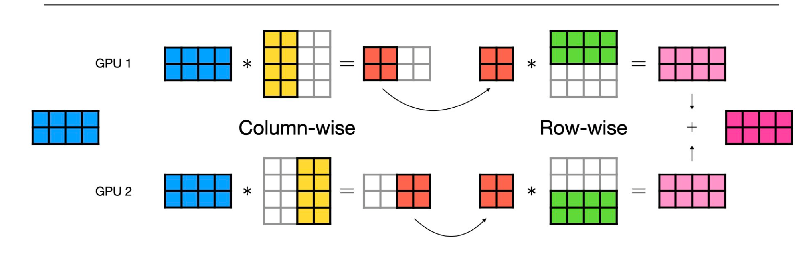
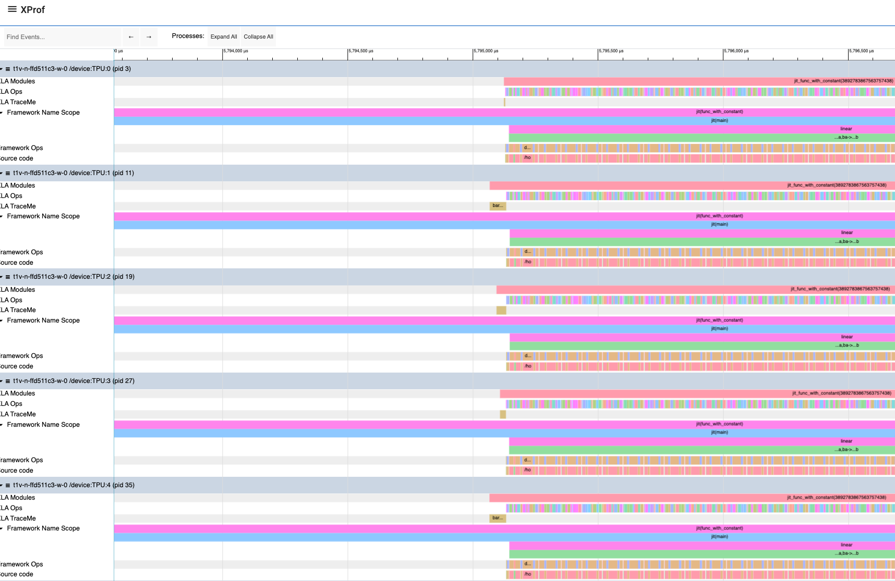

# How to Run a Hugging Face Model in JAX (Part 2)

In the [previous post](01-run-huggingface-model-in-jax.md), we explored how to perform a **forward pass** for a Llama model using Hugging Face and JAX. This time, we'll achieve the same goal, but by utilizing **eight devices** simultaneously.

-----

## Primer on Tensor Parallelism

The parallelization scheme we'll employ is called **tensor parallelism**, sometimes also known as **NeMo-Megatron sharding**.



This [document from Lightning AI](https://lightning.ai/docs/pytorch/stable/advanced/model_parallel/tp.html) explains it exceptionally well. The gist is that we can perform two matrix multiplications (matmuls) – one sharded by column and the other by row – requiring only a **single collective operation (all-reduce)**.

Therefore, we can shard the weights according to the following scheme:

  * **For the Attention Block:**

    1.  **Q, K, and V projections** are sharded by **column** (as they represent the first matmul).
    2.  The **O projection** is sharded by **row** (as it's the second matmul).
    3.  The **Attention mechanism** itself doesn't require communication because it's purely data parallel (the number of heads is sharded).

  * **For the FFNs (Feed-Forward Networks):**

    1.  **Up and Gate projections** are sharded by **column**.
    2.  The **Down projection** is sharded by **row**.

-----

## Primer on JAX's Parallelism Support

Unlike PyTorch, JAX's parallelism support uses the **gSPMD (Generalized Single Program Multiple Data) pattern**. This means that instead of having one process per device and manually managing collectives, we only need to specify a `mesh` and how each array is sharded (via sharding constraints). The XLA compiler then automatically determines where to insert the necessary collective operations.

This process is described in great detail here: [JAX Distributed arrays and automatic parallelization](https://docs.jax.dev/en/latest/notebooks/Distributed_arrays_and_automatic_parallelization.html).

In essence, to run our model in parallel, we need two key things:

1.  **Define a `mesh`**: In our case, it's simply `jax.make_mesh((jax.device_count(), ), ('axis', ))`. Note that the name we give the axis doesn't significantly impact functionality.
2.  **Know how each weight of the model is sharded**.

To figure out the second point, let's print out the model's weights and decide on their sharding.

-----

## Sharding of Weights

Let's print the weights to understand what we're working with. Add the following code right after `weights, func = torchax.extract_jax(model)`:

```python
for name, w in weights.items():
  print(name, w.shape)
```

We'll get output similar to this:

```
model.rotary_emb.inv_freq (64,)
model.embed_tokens.weight (32000, 4096)
model.layers.0.self_attn.q_proj.weight (4096, 4096)
model.layers.0.self_attn.k_proj.weight (4096, 4096)
model.layers.0.self_attn.v_proj.weight (4096, 4096)
model.layers.0.self_attn.o_proj.weight (4096, 4096)
model.layers.0.mlp.gate_proj.weight (11008, 4096)
model.layers.0.mlp.up_proj.weight (11008, 4096)
model.layers.0.mlp.down_proj.weight (4096, 11008)
model.layers.0.input_layernorm.weight (4096,)
model.layers.0.post_attention_layernorm.weight (4096,)
model.layers.1.self_attn.q_proj.weight (4096, 4096)
...
```

The weights span 32 layers. Based on our earlier discussion, we need to shard them as follows:

```
  model.layers.0.self_attn.q_proj.weight (4096, 4096) -> ('axis', None)
  model.layers.0.self_attn.k_proj.weight (4096, 4096) -> ('axis', None)
  model.layers.0.self_attn.v_proj.weight (4096, 4096)-> ('axis', None)
  model.layers.0.self_attn.o_proj.weight (4096, 4096)-> (None, 'axis')
  model.layers.0.mlp.gate_proj.weight (11008, 4096)-> ('axis', None)
  model.layers.0.mlp.up_proj.weight (11008, 4096)-> ('axis', None)
  model.layers.0.mlp.down_proj.weight (4096, 11008)-> (None, 'axis')
```

Besides the weights discussed, there's also a weight for the embedding and another for the final output projection. For these, we have more flexibility in sharding.

Now, we can write our sharding function like this:

```python
def shard_weights_llama(mesh, weights):
  result = {}
  for k, v in weights.items():
    if (('q_proj' in k) or
        ('k_proj' in k) or
        ('v_proj' in k) or
        ('gate_proj' in k) or
        ('up_proj' in k)):
      sharding = P('axis', None)
    elif(('o_proj' in k) or
        ('down_proj' in k) or
        ('lm_head.weight' in k) or
        ('embed_tokens' in k)):
      sharding = P(None, 'axis')
    else:
      sharding = P() # replicated
    result[k] = jax.device_put(v, NamedSharding(mesh, sharding))
  return result
```

Then, we can shard the weights with `weights = shard_weights_llama(mesh, weights)`.

-----

## Running It Again

Now that the weights are sharded, we're almost ready to run the inference in a distributed fashion\! There's one more step: the input also needs to be available on every device so that all devices can perform calculations with it. We can accomplish this by replicating the input:

```python
model_inputs.input_ids = jax.device_put(
  model_inputs.input_ids, NamedSharding(mesh, P())) # replicate
```

Running the script again yields:

```
0 5.062012195587158 seconds
1 0.0038039684295654297 seconds
2 0.0034346580505371094 seconds
```

This is approximately **4.3 times faster** than the single-device version. 🚀

-----

## How Do We Ensure It's Actually Running on 8 Devices?

While we've seen an improvement in inference speed, it wasn't a full 8x speedup. To confirm it's truly utilizing all 8 devices and to understand why the speedup isn't linear, we can use the [JAX profiler](https://docs.jax.dev/en/latest/profiling.html).

To capture a profile, simply wrap the relevant code section with the standard JAX APIs:

```python
with jax.profiler.trace("/tmp/jax-trace", create_perfetto_link=False):
  # Your inference code here
```

I used the xprof plugin with TensorBoard instead of Perfetto due to being on a remote machine. Regardless, the outcome is a visual representation like this:



From this output, you can verify the activity of all 8 devices and identify which operations are running on each. This helps pinpoint bottlenecks and understand the overall parallel execution.

To repro the content of this post, please run
```python
python jax_hg_02.py
```

-----

## Conclusion

We've successfully demonstrated how to run a Llama model's forward pass in a **distributed fashion** without altering the model's core code. The key was simply specifying how the weights should be sharded. We also showed how standard JAX profiling tools can confirm the distributed execution and help in performance analysis.

For the next post, we will do the same with a model from HuggingFace diffusers library.